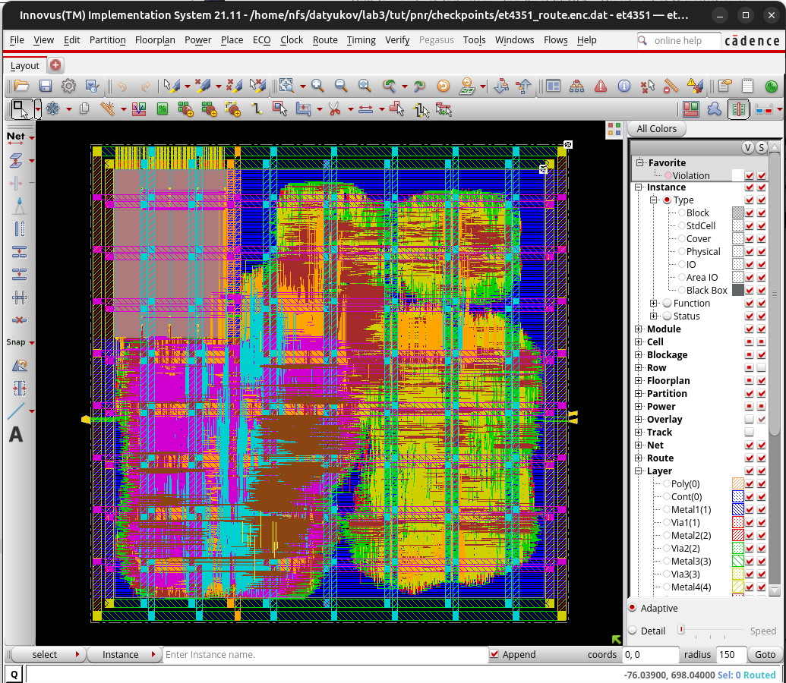

# ET4351 Digital VLSI Systems on Chip

RTL-to-GDS lab series at TU Delft (Faculty of EEMCS, Department of Microelectronics). The design under work is PicoSoC: a PicoRV32 RISC-V core (RV32IMC) with an FFT accelerator, taken from Verilog RTL through synthesis and full physical implementation in GPDK 45 nm using the Cadence flow.

The consolidated report is [ET4351_Labs_Report_5714699.pdf](ET4351_Labs_Report_5714699.pdf); each lab also keeps its own report, run scripts, and captured tool output.

## Final result

Post-route layout of the PicoSoC in Cadence Innovus. The gray block is the SRAM macro; the rest is placed and routed standard-cell logic (about 50,000 instances) under the power grid stripes.

## Lab breakdown

### Lab 1: Project baseline with PicoSoC

Set up the PicoRV32/PicoSoC environment, compiled firmware with the RISC-V GCC toolchain, and verified the design in simulation (Icarus Verilog). Scripts in `lab1/scripts/` reproduce each tutorial and task; console output is captured in `lab1/output/`. See [picorv32-setup.md](picorv32-setup.md) for the toolchain setup.

### Lab 2: Synthesis and design constraints

Synthesized the SoC with Cadence Genus against the GPDK 45 nm standard-cell library: SDC timing constraints, clock definition, timing and area reports, and constraint iteration. Per-tutorial and per-task logs live under `lab2/output/`.

### Lab 3: Physical implementation

Complete place-and-route flow in Cadence Innovus, with one script per stage in `lab3/scripts/`:

floorplanning, power planning, placement, clock tree synthesis, routing, signoff verification (DRC, connectivity), post-layout simulation with back-annotated delays, and final power analysis from switching activity (VCD import).

## Repository layout

| Path | Contents |
| --- | --- |
| `lab1/` | Baseline setup, simulation scripts, task outputs, lab 1 report |
| `lab2/` | Genus synthesis scripts, outputs, lab 2 report |
| `lab3/` | Innovus P&R scripts per stage, outputs, layout screenshot, lab 3 report |
| `connect-et4351.sh` | Helper to connect to the course server environment |
| `picorv32-setup.md` | Local PicoRV32 toolchain and test setup notes |

Tools: Cadence Genus and Innovus 21.11, Icarus Verilog, riscv64-unknown-elf-gcc, GPDK 45 nm PDK.
